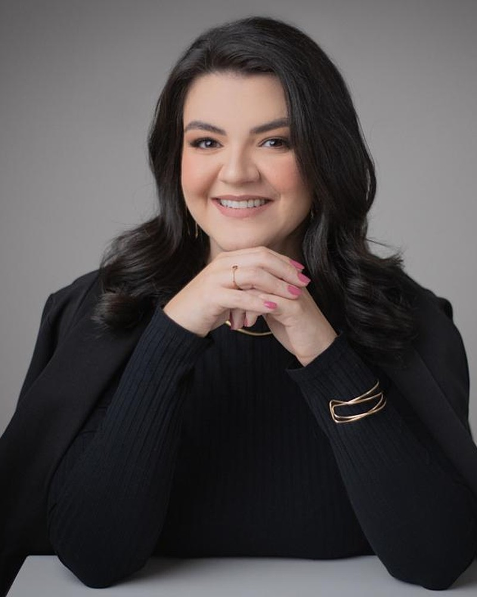
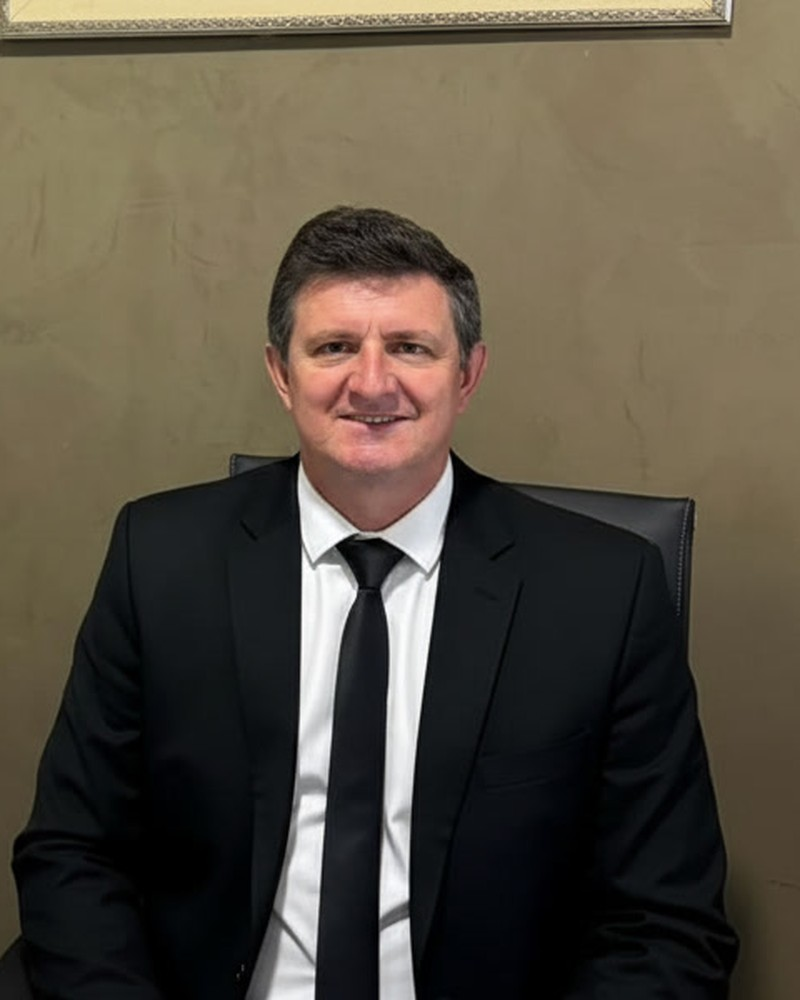

# Site Letícia Mamus — Advogados Associados

Instruções de implementação para o Claude Code.
Referência visual: `Site Leticia Mamus.dc.html` (mockup navegável neste projeto).
Código de origem: `referencia/index-original.html`.

---

## 0. O que fazer, em uma frase

Reescrever o `index.html` existente como uma landing page única, mantendo **exatamente** a paleta dourada/creme e as fontes atuais, **removendo a seção do Sócio** (está sem informação), e elevando o acabamento tipográfico, o contraste, a responsividade e as animações de rolagem.

Não é um redesign. É o mesmo site, melhor executado.

---

## 1. Decisões já tomadas (não reabrir)

| Item | Decisão |
|---|---|
| Seção "Sócio" | Virou a seção **"O Escritório"** (§8): foto horizontal do sócio + copy sobre a sociedade. Os dois são sócios; **Letícia é quem dá nome à firma**. |
| Animação da cadeira vazia → advogado sentado | **Descartada.** O vídeo ficava instável (autoplay bloqueado, travamento em troca de aba, 9:16 num bloco horizontal). Substituída por foto estática com revelação por rolagem. Não reintroduzir. |
| Nome da Dra. Letícia | **Letícia Figueiredo Mamus.** A marca no topo e o rodapé continuam "Letícia Mamus — Advogados Associados" (nome da firma). |
| Formulário de contato | **Não existe.** Conversão é só WhatsApp + e-mail. |
| Tom da escrita | Elegante e acolhedor — como está hoje. Não mudar as copies existentes. |
| Objetivo do site | Profissionalizar o escritório, não captar cliente agressivamente. Sem urgência, sem "fale agora", sem contadores. |
| Novas seções | Apenas **uma** faixa curta de princípios (§4.3). Nada de FAQ, blog, depoimentos ou passo a passo. |

---

## 2. Informações que ainda faltam

Deixe **marcadores no código, comentados**, não texto visível na página. Quando o cliente enviar, é só descomentar.

```html
<!-- PENDENTE: OAB — inserir no rodapé quando disponível
<p class="footer-oab">Letícia Mamus — OAB/MT 00.000 · Sociedade de Advogados OAB/MT 0.000</p>
-->

<!-- PENDENTE: endereço e cidade — inserir como 4º item em .contact-info
<div class="contact-item">
  <span>Escritório</span>
  <p>Rua Exemplo, 000 — Bairro<br>Cidade / MT</p>
</div>
-->

<!-- PENDENTE: Instagram e demais redes — inserir no rodapé -->
<!-- PENDENTE: confirmar o WhatsApp. O link atual é wa.me/5566964555655 (13 dígitos).
     Um celular de MT tem 11 dígitos com país: 55 + 66 + 9 + 8 dígitos.
     Verificar se o correto é 5566996455655 ou 556696455655. -->
```

> **Importante (Provimento OAB nº 205/2021):** o número de inscrição da OAB deve aparecer no site. Isso é obrigatório, não é preferência de design. Assim que o cliente informar, o rodapé precisa exibir. Também não incluir: promessa de resultado, valores, depoimentos de clientes, "melhor advogado", ou qualquer mercantilização.

---

## 3. Tokens de design (não inventar valores)

Copiados do site atual. Manter como estão.

```css
:root {
  --gold:        #B69A56;
  --gold-light:  #C9AE6A;
  --gold-dark:   #9A7F3E;
  --gold-glow:   rgba(182, 154, 86, 0.12);
  --cream:       #F0E8DA;
  --cream-light: #F7F2EA;
  --cream-bg:    #FAF6F0;
  --warm-white:  #FDFBF7;
  --charcoal:    #2A2520;
  --text-main:   #3A3530;
  --text-soft:   #7A7268;
  --text-muted:  #A89E92;
  --border-light: rgba(182, 154, 86, 0.15);
  --ease: cubic-bezier(0.22, 1, 0.36, 1);
}
```

**Tipografia** — mesmas duas fontes de hoje, uma só requisição:

```html
<link rel="preconnect" href="https://fonts.googleapis.com">
<link rel="preconnect" href="https://fonts.gstatic.com" crossorigin>
<link href="https://fonts.googleapis.com/css2?family=Cormorant+Garamond:ital,wght@0,300;0,400;0,500;0,600;0,700;1,300;1,400&family=Raleway:wght@200;300;400;500;600&display=swap" rel="stylesheet">
```

- **Cormorant Garamond** — títulos, números dos cartões, nomes. Pesos 300 (grandes) e 500 (pequenos). Itálico só na palavra destacada do H1.
- **Raleway** — corpo, navegação, botões, tags. 300 corpo, 500/600 uppercase.

**Escala** (usar `clamp`, sem media query para tamanho de fonte):

| Elemento | Tamanho | Peso / detalhes |
|---|---|---|
| Kicker / tag de seção | `0.70rem` | 600, `letter-spacing: 4.5px`, uppercase, `--gold` |
| H1 | `clamp(2.7rem, 4.6vw, 4.5rem)` | Cormorant 300, `line-height: 1.1`, `letter-spacing: -0.5px` |
| H2 de seção | `clamp(2rem, 3.2vw, 3.05rem)` | Cormorant 300, `letter-spacing: -0.3px` |
| H3 de cartão | `1.32rem` | Cormorant 500 |
| Corpo hero | `1rem / 1.85` | Raleway 300, `--text-soft` |
| Corpo cartão | `0.88rem / 1.78` | Raleway 300, `--text-soft` |
| Botão | `0.73rem` | 600, `letter-spacing: 3px`, uppercase |

Aplicar `text-wrap: balance` em H1/H2 e `text-wrap: pretty` em parágrafos.

---

## 4. Estrutura da página

```
<nav>            Início · Serviços · Sobre · Escritório · Contato — fixo, encolhe ao rolar, marca a seção ativa
#inicio          hero: texto à esquerda, retrato à direita
(faixa)          4 princípios — NOVO
#servicos        6 cartões (3×2)
#sobre           retrato + 3 parágrafos
#escritorio      sociedade: texto + retratos dos dois sócios lado a lado (§8)
#contato         WhatsApp / E-mail / Atendimento + CTA
<footer>         copyright (+ OAB quando vier)
botão flutuante  WhatsApp, aparece depois de 420px de rolagem — NOVO
```

### 4.1 Nav

- `position: fixed`, transparente no topo.
- Ao passar de 60px de rolagem: `background: rgba(253,251,247,.92)`, `backdrop-filter: blur(24px)`, padding vertical de `1.35rem` → `0.75rem`, `box-shadow: 0 4px 30px rgba(182,154,86,.07)`, e a marca reduz de `1.35rem` → `1.1rem`.
- **Melhoria:** o link da seção visível fica em `--gold-dark` com `border-bottom: 1px solid var(--gold)`. Usar IntersectionObserver ou cálculo no scroll (§6.4).
- Marca em duas linhas com gradiente `linear-gradient(135deg, #9A7F3E, #C9AE6A)` + `background-clip: text` — como está hoje.
- **Mobile (≤900px):** manter o menu hamburguer que já existe no original, com o drawer de 260px à direita e o overlay escuro. O JS atual funciona, só preservar. (No mockup ele foi substituído por uma linha compacta de links porque o formato do mockup não permite media queries — no site real, use o hamburguer.)

### 4.2 Hero

- `min-height: 100vh`, grid de 2 colunas iguais; 1 coluna abaixo de 900px.
- Dois enfeites de fundo do original, manter: o brilho radial `--gold-glow` no canto superior direito e o fade para `--cream-bg` na base.
- Fundo: `linear-gradient(175deg, #FDFBF7 0%, #F7F2EA 52%, #FAF6F0 100%)`.
- **Melhorias:** kicker agora tem um traço dourado de 34px antes do texto; abaixo do CTA existe um link secundário discreto **"Áreas de atuação"** (âncora `#servicos`) com `border-bottom` dourado; a régua de 64px abaixo do H1 entra com `scaleX` a partir da esquerda em vez de só aparecer.
- Retrato: `width: min(74%, 430px)`, `border-radius: 20px`, `box-shadow: 0 12px 50px rgba(42,37,32,.1)`, moldura interna `1px solid rgba(182,154,86,.14)` e o quadro deslocado `-14px / -14px` atrás.
- Entrada: kicker 0.25s → H1 0.45s → régua 0.65s → parágrafo 0.78s → CTA 0.95s. Foto em `scale(1.05) → 1` com 0.4s de atraso.

### 4.3 Faixa de princípios — NOVA

Uma tira baixa entre hero e serviços, `background: #FAF6F0` com 1px de borda dourada acima e abaixo. Grid `repeat(auto-fit, minmax(230px, 1fr))`. Quatro itens, título em Cormorant 600 `1.05rem` dourado + uma linha de texto:

1. **Foco exclusivo** — Atuação dedicada ao Direito Previdenciário — nada de generalismo.
2. **Análise técnica** — Cada caso é estudado a fundo antes de qualquer pedido ao INSS.
3. **Acompanhamento** — Você sabe em que etapa está o seu processo, do início à concessão.
4. **Presencial e online** — Atendimento com o mesmo cuidado, presencialmente ou a distância.

Sem ícones. Sem números. Sem caixas.

### 4.4 Serviços

Os 6 cartões e todos os textos são **idênticos ao original** — não reescrever. Grid `repeat(auto-fit, minmax(290px, 1fr))`, gap `clamp(1.1rem, 2vw, 1.7rem)`.

Correções em relação ao site atual:

1. **O número do cartão está invisível hoje.** O original usa `background: linear-gradient(180deg, var(--cream) ...)` com `background-clip: text` — creme sobre creme. Trocar por cor sólida `--gold-light` (`#C9AE6A`), Cormorant 300, `2.1rem`, com uma linha dourada em degradê ao lado, ocupando o resto da largura.
2. **Contraste do texto:** o parágrafo do cartão usa `--text-muted` (#A89E92) — reprova em contraste. Usar `--text-soft` (#7A7268).
3. **Hover:** manter `translateY(-5px)` + `box-shadow: 0 18px 50px rgba(182,154,86,.12)` e borda `rgba(182,154,86,.3)`. Remover a barra dourada de 3px que cresce no topo (`::before`) — poluía com 6 cartões.

### 4.5 Sobre

- Grid 2 colunas: foto à esquerda, texto à direita. Colapsa em 1 coluna abaixo de 900px (foto primeiro).
- Os 3 parágrafos são os do original, com os mesmos `<strong>` em `--gold-dark` peso 500.
- **Melhoria — revelação da foto:** em vez de só aparecer, a imagem é revelada por `clip-path: inset(0 0 100% 0)` → `inset(0 0 0 0)` em 1.4s quando 30% dela entra na tela. É a mesma mecânica de gatilho por rolagem que o cliente quer na cena da cadeira (§8) — implemente as duas com o mesmo helper.

### 4.6 Contato

Centralizado, `max-width: 640px`. Régua dourada em degradê no topo. Três blocos em `flex` com `flex-wrap` e `gap: 2.2rem clamp(2rem, 5vw, 4rem)`:

- **WhatsApp** — `(66) 9645-5655` → `https://wa.me/5566964555655`
- **E-mail** — `contato@lfmamus.adv.br` → `mailto:`
- **Atendimento** — `Presencial e Online`

Melhoria: os valores agora são `--text-main` em vez de `--text-soft` (era claro demais para um dado que a pessoa precisa ler). Quando o endereço chegar, entra como quarto bloco.

### 4.7 Rodapé e botão flutuante

- Rodapé: `#F0E8DA`, texto `0.7rem` `--text-muted`, `letter-spacing: 1.5px`. Copyright igual ao atual. Linha da OAB entra aqui.
- **Botão flutuante — NOVO:** círculo de 54px, `linear-gradient(135deg, #B69A56, #C9AE6A)`, ícone WhatsApp branco, canto inferior direito, `z-index: 950`. Invisível até 420px de rolagem; entra com `opacity` + `translateY(14px) → 0`. `aria-label="Falar pelo WhatsApp"`. Em telas ≤600px, subir para `bottom: 1rem` e garantir 44px mínimos de área de toque (54px já resolve).

---

## 5. Responsividade

Breakpoints do original, manter: **900px** e **480px**.

```css
@media (max-width: 900px) {
  /* hero e about em 1 coluna, centralizados */
  /* services-grid: 1 coluna */
  /* nav-links: drawer de 260px à direita, hamburguer visível */
  /* contact-info: coluna */
  /* padding lateral das seções: 1.5rem */
}
@media (max-width: 480px) {
  /* H1 2rem, botões com padding 13px 28px e letter-spacing 2px */
}
```

Onde der, prefira `clamp()` e `repeat(auto-fit, minmax(Xpx, 1fr))` a media query — menos pontos de quebra para manter.

---

## 6. Animações

O cliente pediu para eu opinar: **mais animação, sim — mas só três, e todas discretas.** Site de advocacia previdenciária transmite confiança pela sobriedade; movimento demais parece infoproduto.

### 6.1 Entrada do hero
Sequência escalonada em CSS puro (`@keyframes` + `animation-delay`), como já existe. Não depende de JS — se o JS falhar, o topo continua aparecendo.

### 6.2 Revelação por rolagem
IntersectionObserver com `threshold: 0.12` e `rootMargin: "0px 0px -6% 0px"`. Estado inicial `opacity: 0; transform: translateY(26px)`; ao entrar, `opacity: 1; transform: none` em 0.9s com `--ease`. Escalonar cartões com `data-delay` de 0/100/200ms por linha.

**Duas travas obrigatórias:**

```js
// 1) respeitar quem pediu menos movimento
if (matchMedia('(prefers-reduced-motion: reduce)').matches) { revelarTudo(); return; }
// 2) rede de segurança: nada fica invisível se o observer falhar
setTimeout(revelarTudo, 3500);
```

### 6.3 Revelação da foto do Sobre
`clip-path`, conforme §4.5.

### 6.4 Nav
Estado "scrolled" + seção ativa, num único listener de `scroll` com `{ passive: true }`.

### 6.5 Parallax (opcional, muito leve)
`translateY(scrollY * 0.02)` na foto do hero. Acima de `0.06` fica óbvio e amador. Desligar com `prefers-reduced-motion`.

### 6.6 O que NÃO fazer
Nenhuma biblioteca de animação (nada de GSAP/AOS/Lenis) — isto é uma landing page de uma tela, tudo cabe em ~90 linhas de JS. Sem números que sobem, sem texto digitando, sem carrossel, sem scroll suave sequestrado.

---

## 7. Performance, SEO e acessibilidade

**Imagens** — hoje as duas fotos da Dra. Letícia estão embutidas em **base64 dentro do HTML**, o que infla o arquivo e impede cache. Já extraí em `fotos/`:

| Arquivo | Uso |
|---|---|
| `fotos/leticia-hero.jpg` | retrato do hero |
| `fotos/leticia-sobre.jpg` | retrato da seção Sobre |
| `fotos/socio-escritorio.jpg` | foto horizontal da seção O Escritório (§8) |

`cadeiravazia.jpeg`, `carlos-sentando.mp4` e `carlos.jpeg` **não são mais usados** — remover do projeto.

- Gerar `.webp` de cada foto e servir com `<picture>`, mantendo o `.jpg` de fallback.
- `width`/`height` explícitos em toda `` para não haver salto de layout.
- Foto do hero: `loading="eager"` + `fetchpriority="high"`. Restantes: `loading="lazy"` + `decoding="async"`.

**SEO**

```html
<title>Letícia Mamus Advogados Associados | Direito Previdenciário e INSS</title>
<meta name="description" content="Assessoria jurídica especializada em aposentadorias, benefícios do INSS e planejamento previdenciário. Atendimento presencial e online.">
<link rel="canonical" href="https://lfmamus.adv.br/">
<meta property="og:title" content="Letícia Mamus Advogados Associados">
<meta property="og:description" content="Direito Previdenciário: aposentadorias, benefícios do INSS e planejamento previdenciário.">
<meta property="og:image" content="https://lfmamus.adv.br/fotos/og.jpg">
<meta property="og:type" content="website">
<meta property="og:locale" content="pt_BR">
```

Adicionar JSON-LD `LegalService` — mas **só preencher `address` e `telephone` quando os dados chegarem**; schema com campo falso é pior que schema ausente. Incluir `favicon` e `apple-touch-icon` (monograma "LM" dourado sobre creme serve).

**Acessibilidade**

- Um único `<h1>`, na hero. Seções com `<h2>`. Cartões com `<h3>`.
- `:focus-visible` com contorno dourado de 2px e `outline-offset: 3px` em todo link e botão — hoje não existe estado de foco.
- **Contraste:** o dourado `--gold` (#B69A56) dá 2,5:1 sobre creme e **nunca** deve ser usado em texto corrido, legenda ou link pequeno — só em kickers uppercase grandes, filetes e fundos. `--text-muted` (#A89E92) dá 2,4:1: serve apenas para o copyright do rodapé. Texto que precisa ser lido: `--text-soft` (4,4:1) ou `--text-main` (11,3:1).
- Todo link externo com `target="_blank"` leva `rel="noopener"`.
- `alt` descritivo nas fotos ("Dra. Letícia Mamus, advogada previdenciarista").
- Alvos de toque de 44px ou mais no mobile.
- Adicionar um "pular para o conteúdo" invisível antes da nav.

---

## 8. Seção "O Escritório" — layout aprovado (2a)

Vai **depois** de `#sobre`, antes de `#contato`. Referência visual: opção **2a** em `Mockups Escritorio.dc.html`.

### 8.1 Decisão

O escritório é dos **dois sócios** — a seção mostra **Letícia e Carlos lado a lado**, com o mesmo peso visual. Texto à esquerda (≈ 0.85fr), par de retratos à direita (≈ 1.4fr).

A ideia anterior (vídeo do sócio sentando na cadeira) **foi descartada** — autoplay bloqueado no mobile, travava ao trocar de aba, 9:16 e ~5MB. Não ressuscitar.

**Arquivos que saem do projeto:** `carlos-sentando.mp4`, `carlos.jpeg`, `cadeiravazia.jpeg`, `socio-escritorio.jpg` (versão antiga, camiseta azul).

### 8.2 Conteúdo

> **O Escritório** · Uma sociedade a *quatro mãos*
> O escritório é conduzido por dois sócios, e cada caso passa pelo olhar dos dois — duas leituras da mesma história, uma só estratégia.
> Atendimento presencial ou online, com a mesma escuta atenta.

Legendas sob cada retrato (nome em Cormorant, função em Raleway caixa-alta):

| Retrato | Nome | Função |
|---|---|---|
| esquerda | Dra. Letícia Figueiredo Mamus | Sócia fundadora |
| direita | Dr. Carlos | Sócio |

**PENDENTE:** sobrenome do Carlos e OAB dos dois. Quando chegarem, a linha de função vira `Sócia fundadora · OAB/MT 00.000`. Deixar comentado no HTML, nunca visível como placeholder.

### 8.3 Fotos — recortar no arquivo, não no CSS

Os dois retratos são **4:5**. Recortar os arquivos para que os rostos fiquem no mesmo tamanho (a foto do Carlos é de corpo inteiro, com muito fundo — no mockup foi ampliada via `transform`; em produção o recorte é feito na imagem):

```bash
# Letícia — a partir de leticia-hero.jpg (1024×728)
magick fotos/leticia-hero.jpg -crop 582x728+200+0 +repage -resize 800x1000 fotos/escritorio-leticia.jpg
# Carlos — a partir da foto nova (1024×1024, terno preto)
magick fotos/socio-escritorio-v2.jpg -crop 600x750+400+274 +repage -resize 800x1000 fotos/escritorio-carlos.jpg
for f in fotos/escritorio-*.jpg; do magick "$f" -quality 82 "${f%.jpg}.webp"; done
```

Conferir visualmente: rosto do Carlos no terço superior, com o terno e a mesa visíveis; quadro da parede pode aparecer cortado no topo. Se ficar desalinhado, ajustar só o offset (`+x+y`). Cada arquivo final < 150KB.

A foto da Letícia é a mesma do hero (recortada). Se vier outra foto dela, substituir aqui.

### 8.4 Marcação

```html
<section class="office" id="escritorio">
  <div class="office-inner">
    <div class="office-text" data-animate>
      <span class="section-tag">O Escritório</span>
      <h2 class="section-title">Uma sociedade<br>a <em>quatro mãos</em></h2>
      <p>O escritório é conduzido por dois sócios, e cada caso passa pelo olhar dos dois — duas leituras da mesma história, uma só estratégia.</p>
      <p>Atendimento presencial ou online, com a mesma escuta atenta.</p>
    </div>

    <div class="partners" data-animate data-delay="140">
      <figure class="partner">
        <div class="partner-frame partner-frame--left">
          <picture class="img-reveal" data-reveal-img>
            <source srcset="fotos/escritorio-leticia.webp" type="image/webp">
            
          </picture>
        </div>
        <span class="partner-rule"></span>
        <figcaption>
          <span class="partner-name">Dra. Letícia Figueiredo Mamus</span>
          <span class="partner-role">Sócia fundadora<!-- · OAB/MT 00.000 --></span>
        </figcaption>
      </figure>

      <figure class="partner">
        <div class="partner-frame partner-frame--right">
          <picture class="img-reveal" data-reveal-img>
            <source srcset="fotos/escritorio-carlos.webp" type="image/webp">
            
          </picture>
        </div>
        <span class="partner-rule"></span>
        <figcaption>
          <span class="partner-name">Dr. Carlos<!-- SOBRENOME --></span>
          <span class="partner-role">Sócio<!-- · OAB/MT 00.000 --></span>
        </figcaption>
      </figure>
    </div>
  </div>
</section>
```

### 8.5 CSS

```css
.office { position:relative; overflow:hidden;
  padding: clamp(4.5rem,9vw,7.5rem) clamp(1.5rem,6vw,6rem);
  background: linear-gradient(175deg,#FAF6F0 0%,#FDFBF7 48%,#F7F2EA 100%); }
.office::before { content:""; position:absolute; top:-12%; left:-10%; width:48%; height:124%;
  background: radial-gradient(ellipse at center, rgba(182,154,86,.10) 0%, rgba(182,154,86,0) 66%);
  pointer-events:none; }
.office-inner { position:relative; max-width:1180px; margin:0 auto; display:grid;
  grid-template-columns: minmax(0,.85fr) minmax(0,1.4fr);
  gap: clamp(2.5rem,5vw,4.5rem); align-items:center; }

.partners { display:grid; grid-template-columns:1fr 1fr; gap: clamp(1.5rem,3vw,2.25rem); }
.partner { margin:0; display:flex; flex-direction:column; }

/* moldura deslocada — espelhada: Letícia para a direita, Carlos para a esquerda */
.partner-frame { position:relative; }
.partner-frame::before { content:""; position:absolute; bottom:-14px; width:100%; height:100%;
  border-radius:16px; border:1px solid rgba(182,154,86,.35); z-index:0; }
.partner-frame--left::before  { left:14px; }
.partner-frame--right::before { right:14px; }

.img-reveal { position:relative; z-index:1; display:block; aspect-ratio:4/5;
  border-radius:16px; overflow:hidden;
  box-shadow:0 14px 52px rgba(42,37,32,.13), 0 2px 12px rgba(182,154,86,.08);
  clip-path: inset(0 0 100% 0); transition: clip-path 1.15s var(--ease); }
.img-reveal.is-revealed { clip-path: inset(0 0 0 0); }
.img-reveal img { display:block; width:100%; height:100%; object-fit:cover;
  filter:contrast(1.02) saturate(.95); }
/* segunda foto revela 160ms depois da primeira */
.partner + .partner .img-reveal { transition-delay:.16s; }

.partner-rule { height:1px; margin-top:1.9rem;
  background:linear-gradient(90deg, rgba(201,174,106,0), #C9AE6A, rgba(201,174,106,0)); }
.partner figcaption { display:flex; flex-direction:column; gap:.2rem; margin-top:.9rem; text-align:center; }
.partner-name { font-family:'Cormorant Garamond',serif; font-size:1.3rem; color:var(--text-main); text-wrap:balance; }
.partner-role { font-size:.66rem; letter-spacing:2.6px; text-transform:uppercase;
  color:var(--text-soft); font-weight:500; }   /* NÃO --text-muted: 2,4:1 */

@media (max-width:900px) {
  .office-inner { grid-template-columns:1fr; }   /* texto em cima, retratos embaixo */
}
@media (max-width:480px) {
  .partners { grid-template-columns:1fr; max-width:340px; margin:0 auto; gap:3rem; }
}
```

### 8.6 JS

Nenhum específico. As duas fotos usam o mesmo observador de `clip-path` do §6.3 (`[data-reveal-img]`), incluindo `prefers-reduced-motion` e o `setTimeout` de segurança.

---

## 9. Entrega

Um único `index.html` (CSS no `<head>`, JS antes de `</body>`), a pasta `fotos/`, favicon. Sem build, sem dependências.

**Checklist antes de publicar**

- [ ] Nenhum `[nome do sócio]`, `[Texto ...]` ou placeholder visível na página
- [ ] Zero base64 no HTML; fotos vindo de `fotos/` com `.webp` + fallback
- [ ] Números dos cartões legíveis
- [ ] Texto dos cartões em `--text-soft`, não `--text-muted`
- [ ] Estado de foco visível em todos os links e botões
- [ ] Testado em 1440 / 1024 / 768 / 390px
- [ ] Menu mobile abre, fecha ao clicar num link e travando o scroll do body
- [ ] Com `prefers-reduced-motion`, todo o conteúdo aparece sem animação
- [ ] Com JS desligado, todo o conteúdo continua legível
- [ ] Todos os links de WhatsApp apontando para o mesmo número confirmado
- [ ] Nenhum `<video>` na página; `carlos-sentando.mp4`, `carlos.jpeg` e `cadeiravazia.jpeg` fora do projeto
- [ ] `escritorio-leticia` e `escritorio-carlos` recortados em 4:5, com `.webp` + `width`/`height`, abaixo de 150KB cada
- [ ] "Letícia Figueiredo Mamus" (nome completo) no Sobre, na legenda do Escritório e no copyright; só o logo do nav fica "Letícia Mamus"
- [ ] Legendas dos retratos com contraste ≥ 4,5:1 (nem `--gold`, nem `--text-muted`)
- [ ] Linha da OAB no rodapé (assim que o dado chegar) — exigência do Provimento 205/2021
- [ ] Lighthouse mobile: 95+ em Performance e Acessibilidade
